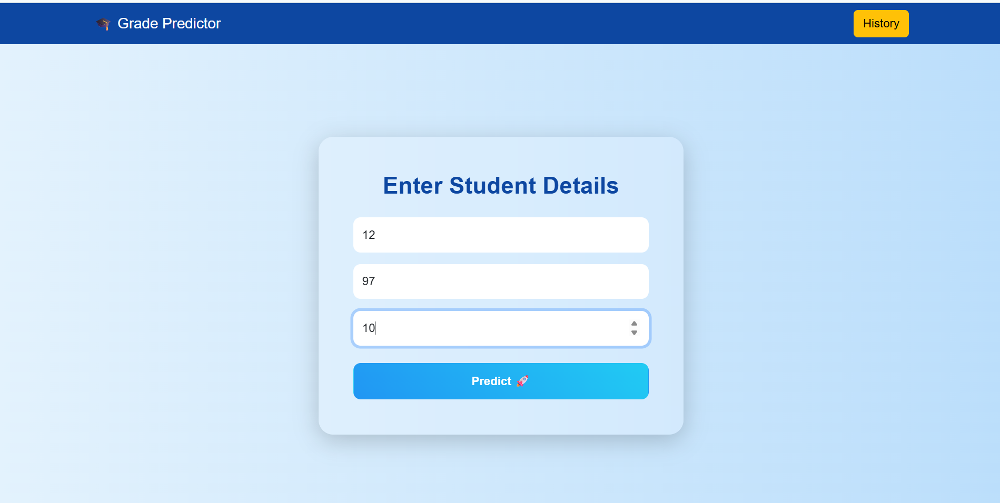
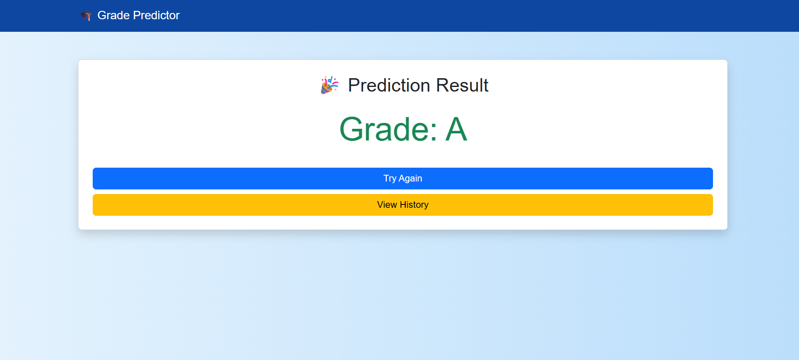
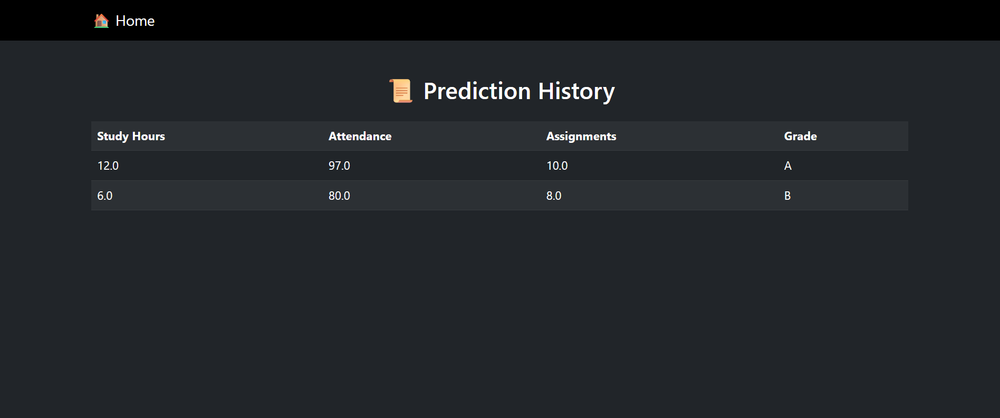

# 🎓 Student Grade Predictor
A full-stack Machine Learning web application that predicts student grades and provides actionable recommendations to improve academic performance.## 📌 Description
The Student Grade Predictor is an intelligent web application that predicts a student's grade based on study hours, attendance, and assignment performance.

It integrates a Machine Learning model with a Flask-based backend to deliver real-time predictions, personalized recommendations, and actionable insights to help students improve their academic outcomes.
The Student Grade Predictor is an intelligent web application that predicts a student's grade based on study hours, attendance, and assignment performance.


---

## 🚀 Features

* 🔮 Predict student grades using Machine Learning
* 💡 Smart Recommendations to improve performance
* 🎯 "How to Reach Grade A" feature for actionable insights
* 📜 User-specific History Tracking using SQLite
* 🌙 Dark Mode support for better user experience
* ✅ Input Validation (Frontend + Backend)
* 🖥️ Modern and responsive UI with Bootstrap
* ⚡ Fast and real-time predictions

---
## ⚙️ How It Works

1. User enters academic details (study hours, attendance, assignments)
2. Flask backend processes the input
3. Machine Learning model predicts the grade
4. System generates recommendations
5. "How to Reach Grade A" logic suggests improvements
6. Data is stored in SQLite database
7. Results are displayed with insights

---
## 🛠️ Tech Stack

* **Frontend:** HTML, CSS, Bootstrap, JavaScript  
* **Backend:** Flask (Python)  
* **Machine Learning:** scikit-learn  
* **Database:** SQLite  
* **Version Control:** Git & GitHub  

---

## 📂 Project Structure

```
Student-Grade-Predictor/
│
├── app.py
├── model.pkl
├── model/
│   └── train_model.py
├── data/
│   └── students.csv
├── templates/
│   ├── index.html
│   ├── predict.html
│   ├── result.html
│   └── history.html
├── static/
│   ├── css/
│   │   └── style.css
│   └── js/
│       └── script.js
├── requirements.txt
└── README.md
```

---

## ▶️ How to Run the Project

1. Clone the repository:

```
git clone https://github.com/keerthana-nagireddy/Student-Grade-Predictor.git
```

2. Navigate to the project folder:

```
cd Student-Grade-Predictor
```

3. Install dependencies:

```
pip install -r requirements.txt
```

4. Run the Flask app:

```
python app.py
```

5. Open in browser:

```
http://127.0.0.1:5000/
```

---

## 📸 Screenshots

### 🏠 Home Page


### 🧠 Prediction Page


### 🎯 Result Page


### 📊 History Page


---

## 🌐 Future Improvements

* 📊 Add data visualization (charts & analytics)
* 🔐 Implement user authentication (login/signup)
* 📈 Performance tracking dashboard
* ☁️ Enhance deployment and scalability

---
## 🌐 Live Demo
🔗 [Live Demo](https://student-grade-predictor-32sj.onrender.com/)

## 👩‍💻 Author

Nagireddy Keerthana

---
